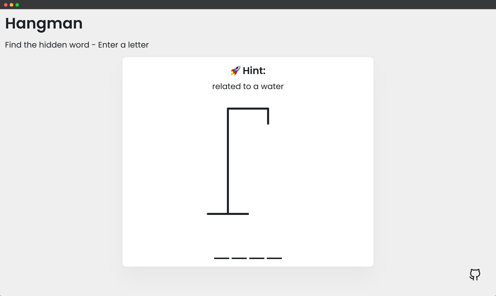
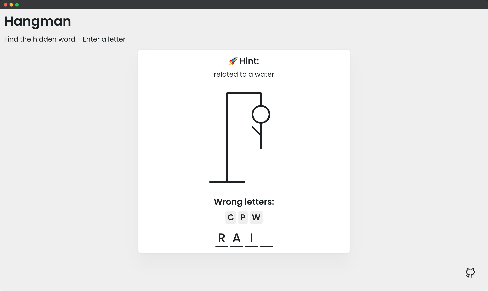
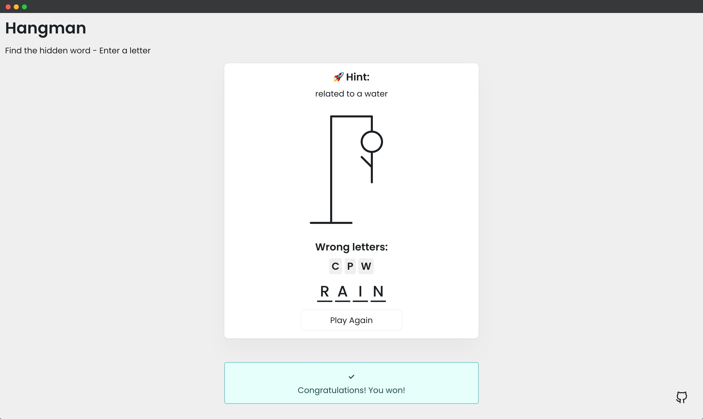
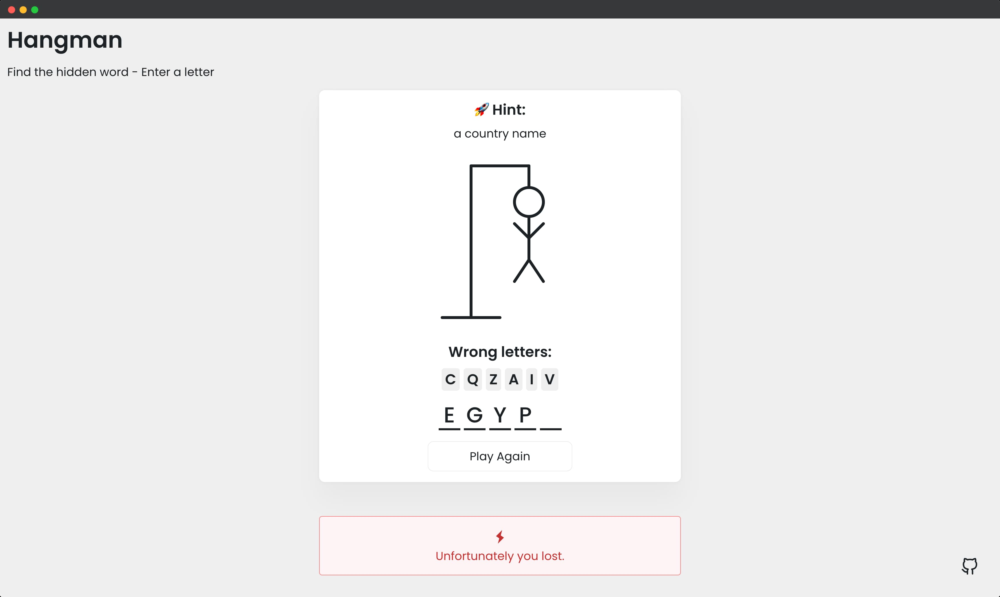

## 📦 Hangman Game

Select a letter to figure out a hidden word in a set amount of chances. **Specifications**:

- Display hangman pole and figure using SVG
- Generate a random word
- Display word in UI with correct letters
- Display wrong letters
- Show notification when select a letter twice
- Show popup on win or lose
- Play again button to reset game

---

#### 🌄 Screenshots:

-----

#### 💻 Stack:

- [JavaScript](https://learn.javascript.ru/)
- [Sass](https://sass-lang.com/)

-----

#### 🙌 Author: [@nagoev-alim](https://github.com/nagoev-alim)
